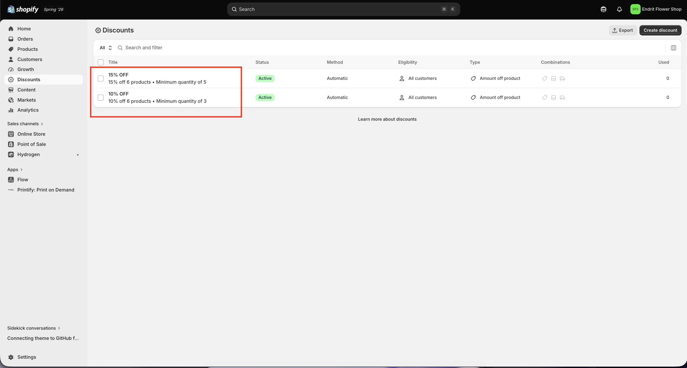

# Custom Bundle Set Creator — Shopify Section

A self-contained Shopify section that lets customers build a product bundle from a curated list, preview their selection with tiered discounts, and add the entire bundle to the cart in one click.

## Live Demo

**URL:** [endrit-flower-shop.myshopify.com](https://endrit-flower-shop.myshopify.com/)
**Password:** `endrit`

---

## Screenshots

### 1. Adding the Section
Search for "Bundle set creator" in the theme customizer and add it to any page. Placeholder cards appear when no products are assigned yet.


### 2. Configuring the Section
Assign products, set the bundle placeholder product, enable category filtering, and configure mobile settings — all from the customizer sidebar. The section settings panel includes text settings, product selection, the bundle placeholder product picker, and mobile behavior options.


### 3. Building a Bundle
Customers select products, choose variants, set quantities, and see live discount progress. The sidebar cart previews the bundle with subtotal, discount, and total.


### 4. Cart Drawer — Bundle Added
After clicking "Add bundle to Cart", the cart drawer opens with all bundle items grouped under the Custom Bundle parent card.


### 5. Cart Drawer — Bundle Expanded
Clicking the bundle card expands it to show individual child products, variant info, bundle subtotal, discount breakdown, total, and the "Remove bundle" button.


### 6. Removing a Bundle
Clicking "Remove bundle" shows a loading spinner while all bundle items (parent + children) are removed from the cart in one request. Non-bundle items remain unaffected. If the cart becomes empty, the drawer closes automatically.


### 7. Shopify Automatic Discounts
The bundle discount is applied at checkout using **Shopify's built-in automatic discounts** — no scripts or third-party apps required. Two automatic discounts are configured in Shopify Admin to match the bundle tiers:

- **10% OFF** — "Amount off products", 10% off all products, minimum quantity of 3
- **15% OFF** — "Amount off products", 15% off all products, minimum quantity of 5

These discounts are **automatic** — they apply at checkout without a coupon code. When a customer adds a bundle with 3+ items, Shopify automatically applies the best matching discount. The discounts stack with the visual discount shown in the bundle builder, ensuring the price the customer sees matches what they pay.



> **Note:** The discount percentages displayed in the bundle builder sidebar are a visual preview. The actual price reduction happens at checkout via these automatic discounts. Make sure the Shopify discount thresholds match the `DISCOUNT_TIERS` array in the section's JavaScript.

---

## Files Overview

| File | Location in Dawn theme | Purpose |
|------|----------------------|---------|
| `custom-bundle-set-creator.liquid` | `sections/` | The main bundle builder section — product grid, sidebar cart, discount tiers, and add-to-cart logic |
| `cart-drawer.liquid` | `snippets/` | Modified cart drawer that groups bundle items under a collapsible parent card |
| `main-cart-items.liquid` | `sections/` | Modified cart page with the same bundle grouping as the cart drawer |
| `header.liquid` | `sections/` | Modified header to use bundle-aware cart count (each bundle counts as 1 item) |
| `cart-icon-bubble.liquid` | `sections/` | Modified cart icon bubble to count bundle items as a single unit instead of individual products |

---

## Setup Instructions

### 1. Create the Bundle Placeholder Product

In Shopify Admin, create a product that acts as the bundle identifier:

- **Title:** `Custom Bundle` (or any name you prefer)
- **Price:** `€0.00`
- **Track inventory:** Unchecked
- **Status:** Active
- **Sales channels:** Must be available on the Online Store (removing it from Point of Sale is fine, but it must remain on the storefront or the variant ID will fail to render)

This product appears as the parent line item in the cart. It carries no cost — pricing comes from the individual child products.

### 2. Add the Section Files to Your Theme

1. Copy `custom-bundle-set-creator.liquid` into your theme's `sections/` directory
2. Replace `snippets/cart-drawer.liquid` with the provided `cart-drawer.liquid`
3. Replace `sections/main-cart-items.liquid` with the provided `main-cart-items.liquid`

### 3. Configure the Section

1. Open the Shopify Theme Customizer
2. Add the **"Bundle set creator"** section to your desired page
3. Configure the section settings:

   **Text settings:**
   - **Heading** and **Description** — customize the display text

   **Product settings:**
   - **Enable filtering** — toggle product category tabs (based on product tags)
   - **Select your products** — choose up to 6 products for the bundle grid
   - **Assign the bundle set placeholder product** — select the `Custom Bundle` product created in step 1

   **Mobile settings:**
   - **Auto-open bundle cart on mobile** — when enabled, the bottom sheet opens automatically after adding a product on mobile; when disabled, the bottom bar flashes briefly to draw attention instead

### 4. Cart Icon Bubble (Optional)

To make the header cart count treat each bundle as 1 item instead of counting every child product individually, replace the cart icon bubble markup in your theme's header with the bundle-aware version. This uses Liquid to count bundle parents as 1 and skip bundle children.

The counting logic:
- **Bundle parent** → counts as 1 (tracked by `_bundle_id` to avoid duplicates)
- **Bundle child** → skipped entirely
- **Normal item** → counts by quantity as usual

---

## Discount Implementation

### Tiered Discount System

Discounts are applied based on the total number of items in the bundle:

| Items in Bundle | Discount |
|----------------|----------|
| 1 item | Cannot add to cart (minimum 2 required) |
| 2 items | No discount |
| 3–4 items | 10% off |
| 5+ items | 15% off |

Thresholds and percentages are configured in the `DISCOUNT_TIERS` array at the top of the section's `<script>` block:

```javascript
const DISCOUNT_TIERS = [
  { qty: 3, percent: 10 },
  { qty: 5, percent: 15 }
];
```

### Minimum Bundle Size

The "Add bundle to Cart" button is disabled until at least 2 products are in the bundle. Attempting to add with only 1 product shows the error message: *"Add at least 2 products to create a bundle."*

### How Bundle Items Are Linked

When a customer clicks "Add bundle to Cart", all items are sent to the Shopify AJAX Cart API (`/cart/add.js`) with `_` prefixed properties that link them together:

**Parent item** (the $0 placeholder product):
```json
{
  "_bundle_id": "bundle_1782031576049",
  "_bundle_name": "Custom Bundle",
  "_bundle_parent": "true",
  "_bundle_discount": "10%"
}
```

**Child items** (the actual products):
```json
{
  "_bundle_id": "bundle_1782031576049",
  "_bundle_name": "Custom Bundle",
  "_bundle_child": "true",
  "_bundle_discount": "10%"
}
```

- `_bundle_id` — Unique timestamp-based ID shared by all items in a bundle. This is the key that links parent and children together.
- `_bundle_parent` / `_bundle_child` — Distinguishes the placeholder from the real products.
- `_bundle_discount` — Stores the discount percentage for reference in the cart UI.
- Properties prefixed with `_` are hidden from the customer in Shopify's default cart UI but remain accessible in Liquid via `item.properties`.

### Cart Grouping (Liquid Server-Side)

Both `cart-drawer.liquid` and `main-cart-items.liquid` use the same Liquid pattern to visually group bundle items:

1. Loop through `cart.items`
2. Skip any item with `_bundle_child: "true"` (rendered inside the parent group instead)
3. When a `_bundle_parent` is found, render a grouped card that:
   - Displays the bundle image, name, item count, and discount badge
   - Loops through `cart.items` again to find children with the same `_bundle_id`
   - Shows subtotal, discount amount, and total
   - Includes a "Remove bundle" button and expand/collapse toggle
4. Non-bundle items render normally with the default Dawn cart item markup

This approach is entirely server-side — no JavaScript is needed for the grouping. It survives page refreshes, works on initial page load, and doesn't rely on localStorage or DOM manipulation.

---

## Features

### Bundle Builder Section
- **Product grid** with images, prices, variant selectors, and quantity inputs
- **Variant image switching** — selecting a different variant updates the product card image with a loading spinner transition
- **Category filtering** via product tags (toggleable in settings)
- **Sidebar cart preview** showing selected items, quantities, discount progress bar, and totals
- **Animated total** that counts up/down when items are added or removed
- **Progress bar** with tier indicators (e.g., "Add 2 more for 10% off")
- **Minimum 2 products required** — the checkout button stays disabled until at least 2 items are added
- **localStorage persistence** — the in-progress bundle survives page navigations; cleared on successful add-to-cart

### Cart Drawer & Cart Page
- **Bundle grouping** — parent + children rendered as a single collapsible card
- **Expand/collapse toggle** to show or hide child items
- **Bundle subtotal, discount, and total** displayed in the group footer
- **Remove bundle** button that removes all items (parent + children) in one click
- **Non-bundle items** render with the standard Dawn cart item UI
- **Cart icon bubble** updates correctly even when adding to an empty cart (creates the count bubble element if it doesn't exist)
- **Scoped event listeners** — cart drawer and cart page use separate delegated listeners to avoid toggle conflicts

### Mobile Experience (below 769px)
- **Bottom sheet** — the sidebar cart slides up from the bottom of the screen
- **Fixed toggle bar** — appears at the bottom when the bundle section is in view, showing "Your Bundle (X items)"
- **Auto-open setting** — configurable in the theme customizer; when enabled, the sheet opens automatically after adding a product; when disabled, the bar flashes subtly instead
- **Drag-to-dismiss** — the sheet handle can be tapped or dragged downward (60px+ threshold) to close
- **Grid toggle** — switch between 1-column and 2-column product layouts
- **IntersectionObserver** — the toggle bar only shows when the bundle section is visible in the viewport

---

## Technical Notes

### Cart Drawer Empty-to-Filled Transition

When adding a bundle to an empty cart, Dawn's built-in `renderContents()` method crashes because it calls `trapFocus()` on DOM elements that don't exist yet. The section bypasses this by:

1. Fetching fresh section HTML via the Section Rendering API (`/?sections=cart-drawer,cart-icon-bubble`)
2. Manually injecting the HTML into `.drawer__inner`
3. Opening the drawer by setting the `<details open>` attribute directly

### Cart Icon Bubble Creation

When the cart was previously empty, the `.cart-count-bubble` element doesn't exist in the DOM. After adding items, the section creates this element from the freshly rendered section HTML and appends it to `#cart-icon-bubble`, rather than trying to update a non-existent element.

### Event Listener Scoping

The cart drawer and cart page both have toggle/remove handlers for bundle groups. To prevent double-firing (which would toggle open then immediately closed), each listener is scoped to its own container:
- Cart drawer → listens on the `cart-drawer` element
- Cart page → listens on `#main-cart-items` with capture phase (`true`) to intercept before Dawn's `cart.js`

### Variant Image Loading

When switching variants, a hidden `new Image()` preloads the new image. During loading, the card shows:
- The current image at 30% opacity
- A centered CSS spinner animation

Once the new image loads, the spinner disappears and the image returns to full opacity. On cached images this transition is nearly instant.

---

## Limitations

1. **Discount requires matching Shopify automatic discounts** — The bundle builder displays discount percentages in the UI, but the actual price reduction at checkout is handled by Shopify automatic discounts configured in Admin (see Screenshots, step 7). If the automatic discounts are removed or their thresholds don't match the `DISCOUNT_TIERS` array, the customer will see a discount preview but not receive it at checkout.

2. **Individual item editing at checkout** — Shopify's checkout shows all line items individually. Customers can technically modify quantities of individual bundle items at checkout. The bundle grouping is a presentation layer in the cart only.

3. **Bundle items are separate line items** — Each product in the bundle is a separate Shopify line item. This is by design — it preserves inventory tracking, variant management, and pricing at the Shopify level. The grouping is purely visual.

4. **Single section limit** — The schema limits the section to 1 instance per page. Multiple bundle sections on different pages work fine since state is scoped by section ID.

5. **Product limit** — The section supports up to 6 products in the bundle grid (configurable in the schema's `product_list` limit).

6. **Theme dependency** — The cart drawer and cart page modifications are built for Shopify's Dawn theme. Other themes may require adjustments to the Liquid markup and CSS class names.

7. **Bundle placeholder product** — The $0 placeholder product must remain available on the Online Store sales channel. Removing it from the storefront (or from all sales channels) will cause a JavaScript syntax error because the variant ID renders as empty.

---

## Browser Support

- All modern browsers (Chrome, Firefox, Safari, Edge)
- Mobile Safari and Chrome on iOS/Android
- Uses `IntersectionObserver` (supported in all modern browsers) for the mobile toggle bar visibility
- Touch events for the drag-to-dismiss sheet handle
- `localStorage` for bundle state persistence (gracefully degrades if unavailable)
